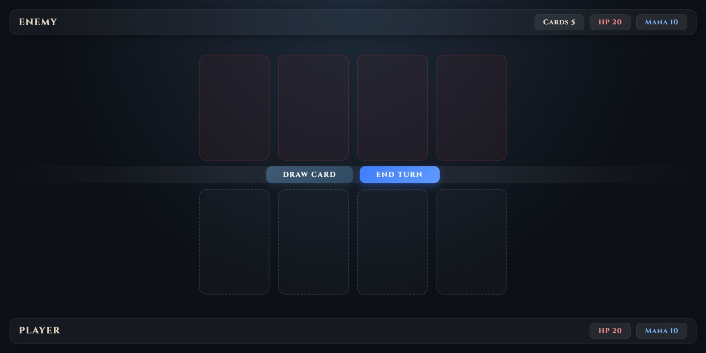
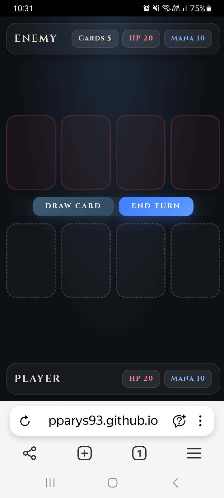

<div align="center">

```
  ⚔️  ✦  ⚔️  ✦  ⚔️  ✦  ⚔️  ✦  ⚔️
 ╔═══════════════════════════════╗
 ║   . : C A R D   D U E L : .   ║
 ╚═══════════════════════════════╝
  ⚔️  ✦  ⚔️  ✦  ⚔️  ✦  ⚔️  ✦  ⚔️
```


</div>

# ⚔️ Card Duel ⚔️

A browser-based fantasy card game interface — a long-term frontend portfolio project focused on clean architecture, responsive design, and accessibility-first thinking.

## 📖 About The Project 📖

Card Duel is a turn-based fantasy card game built in the browser. Two players face each other across a battlefield, placing cards, managing mana, and fighting to reduce the opponent's HP to zero.

The project currently focuses on building a strong frontend architecture and a polished user interface before implementing full game logic and React integration.

The main purpose of this project is to:
- improve frontend development skills,
- practice modern HTML & CSS architecture,
- learn scalable project organization,
- build reusable UI structures,
- prepare the application for JavaScript and React implementation,
- document continuous learning progress through a real development workflow.

---

## 🛠️ Current Tech Stack 🛠️
- HTML5
- CSS3
- Git & GitHub
- Visual Studio Code

---

## ✨ Current Features ✨

### 🗺️ Responsive Game Layout 🗺️
- CSS Grid-based battlefield structure,
- separate enemy and player sections,
- center action area for game controls,
- responsive spacing using `clamp()`.

### 🧙 Player Interface 🧙
- Dedicated enemy and player status panels,
- HP and Mana indicators,
- card counter structure,
- glassmorphism-inspired UI containers,
- fully responsive stat elements.

### 🃏 Game Board 🃏
- Interactive board slots,
- hover animations,
- keyboard focus support,
- accessible slot labels using `aria-label`.

### 🎨 UI & Visual Design 🎨
- fantasy-inspired visual style,
- dark gradient background,
- smooth transitions and hover effects,
- custom typography using Google Fonts,
- subtle depth effects using shadows and backdrop blur.

### ♿ Accessibility & UX ♿
- semantic HTML structure,
- keyboard-accessible interactive elements,
- `focus-visible` states,
- improved button accessibility,
- touch-friendly controls.

### 🧱 CSS Architecture 🧱
- BEM naming convention,
- CSS custom properties (`:root` variables),
- modular section-based stylesheet organization,
- scalable component structure,
- reusable utility-like design tokens.

---

## ✍🏻 Planned Features ✍🏻

### 1️⃣ Phase — JavaScript Features
- Full turn-based game logic,
- card placement system,
- mana system,
- health system,
- turn management,
- win/lose conditions,
- dynamic card rendering.

### 2️⃣ Phase — UI Improvements
- Card animations,
- drag & drop mechanics,
- responsive mobile layout improvements,
- visual spell/effect animations,
- sound effects,
- hand/deck interface.

### 3️⃣ Phase — React Migration
- reusable components,
- state management,
- dynamic rendering,
- component-based architecture,
- scalable game state handling.

---

## 📁 Project Structure 📁

```
card-duel-project/
│
├── index.html
├── styles.css
│
├── assets/
│   └── images/
│
├── scripts/ (planned)
│
└── README.md
```

## 🌱 DOM Structure 🌱

```
ENEMY REGION
├── .player__panel .player-panel--enemy
│    ├─ .player-panel__name
│    └─ .player-panel__stats
│        ├─ .player-panel__stat--cards-counter
│        ├─ .player-panel__stat--hp
│        └─ .player-panel__stat--mana
│
├── .board .board--enemy
│    └─ .board__slot * 4
│
MUTUAL REGION
├── .turn-controls
│    ├─ .button .button--draw-card
│    └─ .button .button--end-turn
│
PLAYER REGION
├── .board .board--player
│    └─ .board__slot * 4
│
├── .card-hand
│    └─ .card * N
│        ├─ .card__art
│        ├─ .card__content
│        │    ├─ .card__title
│        │    └─ .card__description
│        └─ .card__stat (--attack or --health)
│
└── .player__panel .player-panel--player
     ├─ .player-panel__name
     └─ .player-panel__stats
         ├─ .player-panel__stat--hp
         └─ .player-panel__stat--mana
```

## 🎯 Development Goals 🎯

This project is also used to practice a professional frontend workflow:
- version control with Git,
- regular commits,
- responsive UI architecture,
- writing maintainable code,
- accessibility-first thinking,
- scalable frontend structure,
- preparing production-like project organization.

---

## 🚧 Project Status 🚧

The current version focuses on:
- responsive UI foundations,
- scalable CSS architecture,
- accessibility improvements,
- preparing the project for JavaScript game systems.

> 🚀 **[Live Demo](https://pparys93.github.io/card-duel)**

---

## 📸 Screenshots 📸

| Desktop | Mobile |
|---|---|
|  |  |

---

## 🎓 What I Learn Through This Project 🎓

This isn't just a game — it's a structured self-education path through the joy of coding 😄

| ✅ Completed | 🔄 In Progress |
|---|---|
| Semantic HTML | JavaScript — DOM manipulation, game logic, events |
| Modern CSS architecture | React — components, state, dynamic rendering |
| Responsive layouts | |
| CSS Grid & Flexbox | |
| Accessibility fundamentals | |
| UI/UX principles | |
| Git & GitHub workflow | |
| Scalable frontend structure | |
| Component thinking | |

---

## 👤 Author

[](https://github.com/pparys93)
[](https://linkedin.com/in/przemys%C5%82aw-parys-85a47621a)