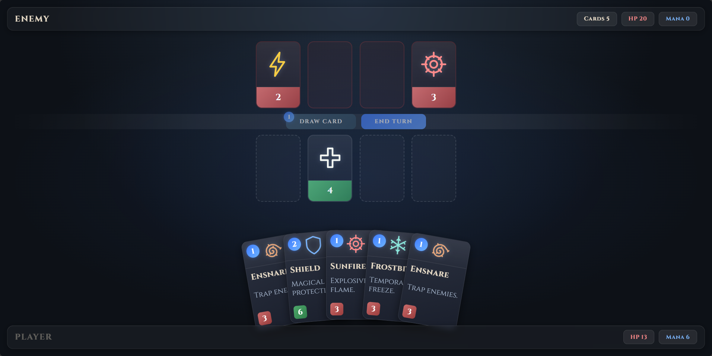
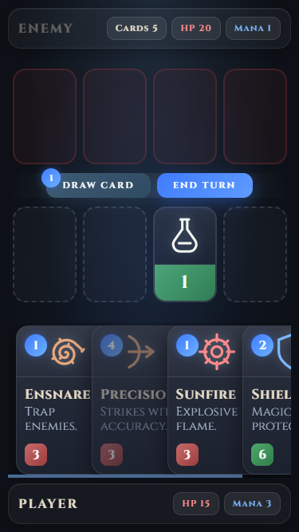
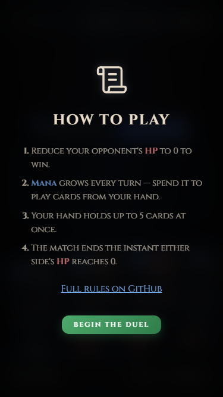
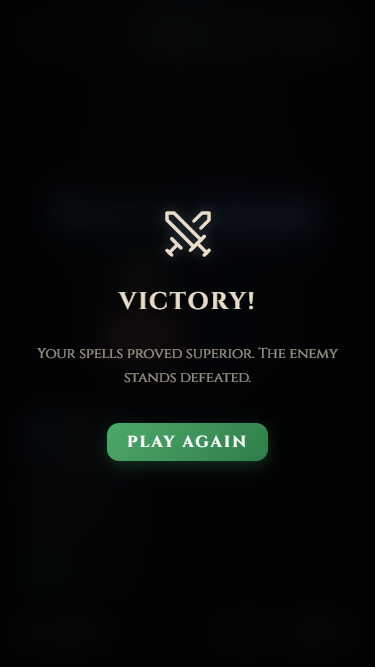
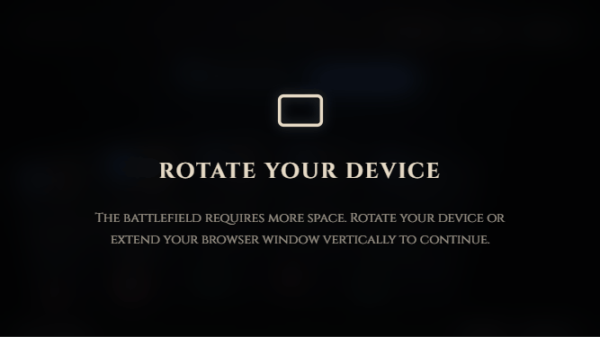
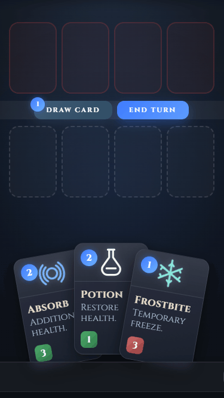
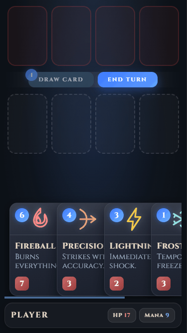
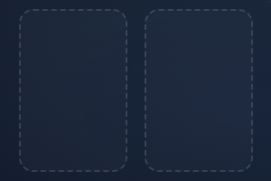
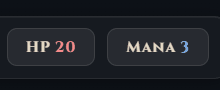

<div align="center">

# ✦ Card ⚔️ Duel ✦


</div>

A browser-based fantasy card game built as a frontend portfolio project. The third milestone (`UI Improvements`) is complete. The game now offers a more polished and immersive experience, enhancing the feel of every match. Next up: migrating the architecture to React.

---

## ℹ️ About The Project

Card Duel is a turn-based fantasy card game built in the browser. The player faces an AI opponent across a battlefield, placing cards, managing mana, and fighting to reduce the opponent's HP to zero.
The project aims to deliver a fully playable game experience - from a polished UI to complete game logic entirely in the browser.

### 📜 Game Rules

1. Reduce your opponent's HP to 0 to win.
2. Attack cards deal damage to the enemy; heal cards restore your own HP.
3. Your hand can hold up to 5 cards.
4. Both sides start with 1 Mana and gain +2 Mana at the start of each subsequent turn, up to a maximum of 10.
5. Drawing a card is optional, costs 1 Mana, and can only be done once per turn.
6. Playing a card costs its Mana value. Board slots limit you to 4 cards per turn.
7. Cards placed on the board cannot be moved or returned to your hand.
8. Card effects resolve immediately when played.
9. HP starts at 20 and cannot exceed this cap.

---

## 🎯 Development Goals

This project is also used to practice a professional frontend workflow:
- version control with Git,
- regular commits,
- responsive UI architecture,
- writing maintainable code,
- accessibility-first thinking,
- scalable frontend structure,
- preparing production-like project organization.

---

## 🛠️ Current Tech Stack
- HTML5
- CSS3
- JavaScript (ES6+)
- Git & GitHub
- Visual Studio Code

---

## ✨ Current Features

### 📐 Responsive Game Layout
- CSS Grid-based battlefield structure,
- separate enemy and player sections,
- center action area for game controls,
- responsive spacing using `clamp()`,
- horizontal scrolling for the hand on touch devices.

### 🃏 Game Board
- interactive board slots,
- hover animations,
- keyboard focus support,
- player hand interface,
- fan-style hand layout by default, classic overlap on touch devices,
- enemy and player status panels with HP and mana indicators plus a static card counter for enemy,
- drag-and-drop card placement alongside click-to-place.

### 🎨 UI & Visual Design
- fantasy-inspired visual style,
- dark gradient background,
- smooth transitions and hover effects,
- custom typography using Google Fonts,
- minimalist stroke-based icon system, spanning card spell and overlay screens,
- glassmorphism-inspired UI containers,
- subtle depth effects using shadows and backdrop blur,
- animated card entrances and spell-cast glow effects,
- floating damage/heal indicators over stat panels.

### 🔊 Sound Design
- audio feedback for core card interactions, including drawing, previewing, selecting, and playing cards,
- distinct sound cues for interface actions, spell effects, and match outcomes.

### ♿ Accessibility & UX
- semantic HTML structure,
- keyboard-accessible interactive elements,
- `focus-visible` states,
- ARIA markup for screen reader support,
- touch-friendly controls,
- `prefers-reduced-motion` support,
- visually hidden headings for screen readers using the `visually-hidden` class,
- screen-guard overlay when the browser window is too short or the device is in a non-optimal orientation,
- game rules overlay shown on load, introducing new players to the mechanics before their first move.

### 🧱 CSS Architecture
- BEM naming convention,
- CSS custom properties (`:root` variables),
- modular section-based stylesheet organization,
- scalable component structure,
- reusable utility-like design tokens.

### ⚙️ JavaScript Features
- dynamic card rendering,
- dynamic fan-layout scaling based on hand size,
- card placement system,
- mana system,
- turn management,
- draw card mechanic,
- health system,
- enemy turn logic,
- win/lose conditions,
- pointer-based drag and drop,
- audio feedback system.

---

## 🗺️ Roadmap

| Version | Milestone | Status |
|---|---|---|
| [`v0.1.0`](https://github.com/pparys93/card-duel/releases/tag/v0.1.0) | HTML/CSS Foundation | ✅ Done |
| [`v0.2.0`](https://github.com/pparys93/card-duel/releases/tag/v0.2.0) | JavaScript Core | ✅ Done |
| [`v0.3.0`](https://github.com/pparys93/card-duel/releases/tag/v0.3.0) | UI Improvements | ✅ Done |
| [`v0.4.0`](https://github.com/pparys93/card-duel/releases/tag/v0.4.0) | Rules Overlay | ✅ Done |
| `v1.0.0` | React Migration | ⏳ Planned |

---

## ✍🏻 Planned Features

### 🔄 React Migration
- reusable components,
- state management,
- dynamic rendering,
- component-based architecture,
- scalable game state handling.

---

## 📁 Project Structure

```
card-duel/
│
├── index.html
├── styles.css
├── favicon.ico
│
├── assets/
│   ├── audio/
│   ├── favicons/
│   └── images/
│
├── scripts/
│   ├── icons.js
│   ├── cards.js
│   └── main.js
│
├── README.md
└── CHANGELOG.md
```

---

## 🌱 Game Arena Layout Structure

```
ENEMY REGION
├── .player-panel .player-panel--enemy
│    ├─ .player-panel__name
│    └─ .player-panel__stats
│        ├─ .player-panel__stat (Cards)
│        ├─ .player-panel__stat--hp
│        └─ .player-panel__stat--mana
│
├── .board .board--enemy
│    └─ .board__slot * 4
│
MUTUAL REGION
├── .turn-controls
│    ├─ .button .button--draw-card
│    └─ .button .button--end-turn
│
PLAYER REGION
├── .board .board--player
│    └─ .board__slot * 4
│
├── .card-hand
│    └─ .card * N (max 5)
│        ├─ .card__mana
│        ├─ .card__art
│        ├─ .card__content
│        │    ├─ .card__title
│        │    └─ .card__description
│        └─ .card__stat (--attack or --heal)
│
└── .player-panel .player-panel--player
     ├─ .player-panel__name
     └─ .player-panel__stats
         ├─ .player-panel__stat--hp
         └─ .player-panel__stat--mana
```

---

## 🚧 Project Status

Current version: [`v0.4.2`](./CHANGELOG.md)

> 🚀 **[Live Demo](https://pparys93.github.io/card-duel)**

---

## 📸 Preview

### 🖼️ Layout

| Desktop | Mobile |
|---|---|
|  |  |

### 🎭 Overlays

| Game Rules | Game Over |
|---|---|
|  |  |

| Screen Guard |
|---|
|  |

### 🃏 Card Placement Mechanics

| Drag & Drop | Tap to Place |
|---|---|
|  |  |


### ✨ Card Animations & Spell Effects

| Card Entrance | Stats Update |
|---|---|
|  |  |

---

## 🎓 What I'm Learning Through This Project

This isn't just a game. It's a structured self-education path through the joy of coding 😄

| ✅ Completed | 🔄 In Progress |
|---|---|
| Semantic HTML | JavaScript: DOM manipulation, game logic, events |
| Modern CSS architecture | React: components, state, dynamic rendering |
| Responsive layouts | |
| CSS Grid & Flexbox | |
| Accessibility fundamentals | |
| UI/UX principles | |
| Git & GitHub workflow | |
| Scalable frontend structure | |
| Component thinking | |

---

## 👤 Author

[](https://github.com/pparys93)
[](https://linkedin.com/in/przemys%C5%82aw-parys-85a47621a)
